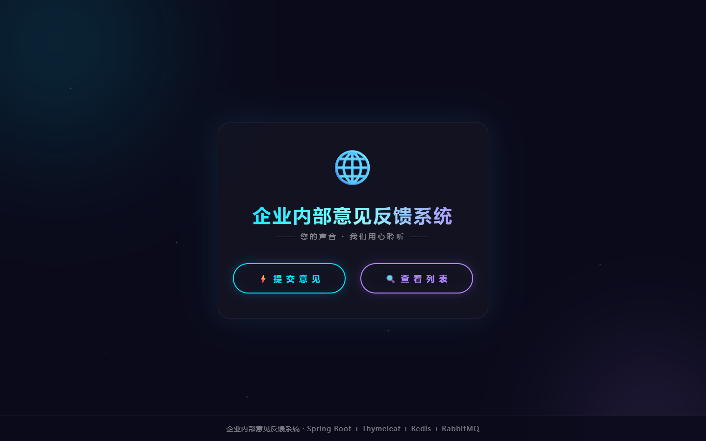
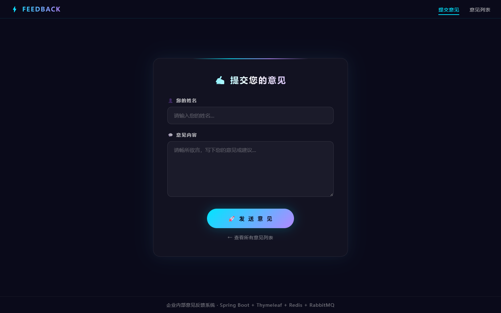
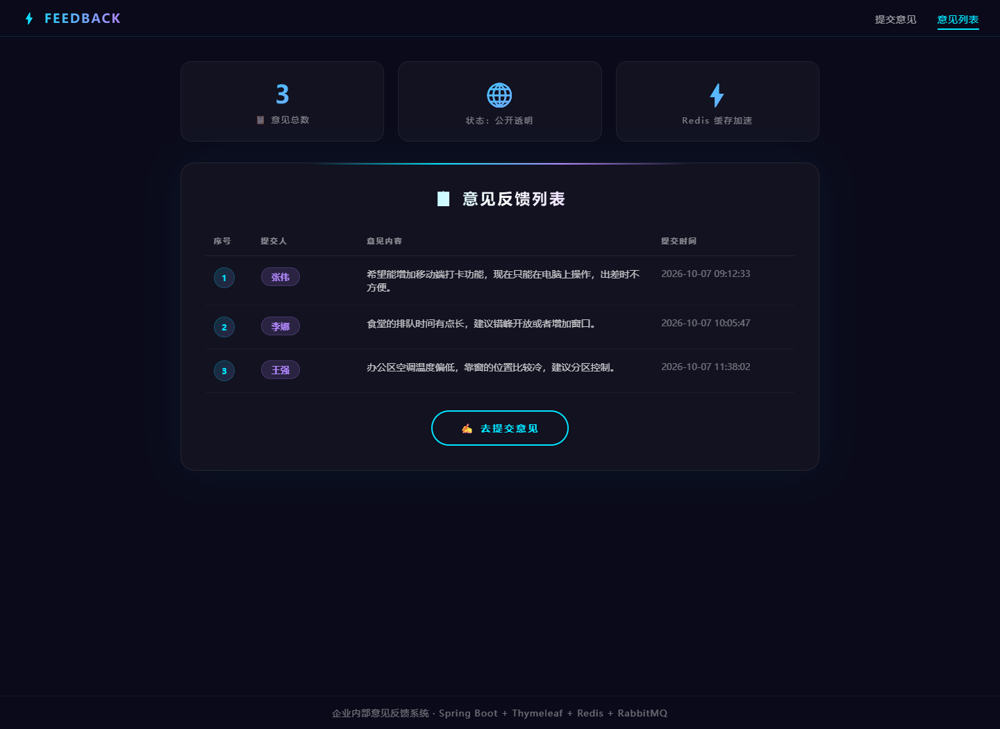

# 企业内部意见反馈系统

一个用于收集与展示企业内部意见的 Spring Boot 单体应用。核心不在功能有多复杂，而在于把
**Redis 缓存**与 **RabbitMQ 异步通知**这两件事做在了一个能跑通的完整业务闭环里——提交意见后
立刻能在列表页看到（缓存失效），同时下游通过 MQ 收到通知（异步解耦）。

> 技术栈：Spring Boot 2.7.18 · MyBatis-Plus 3.5.5 · MySQL 8 · Redis · RabbitMQ · Thymeleaf

---

## 功能

| 页面 | 路径 | 说明 |
| --- | --- | --- |
| 首页导航 | `GET /` | 系统入口，跳转提交页与列表页 |
| 意见提交 | `GET /submit` | 表单页，Thymeleaf `th:object` + `th:field` 双向绑定 |
| 提交处理 | `POST /submit` | 落库 → 发射 MQ 通知 → 清除列表缓存 → 重定向到列表页 |
| 意见列表 | `GET /list` | 统计条 + 意见表格，查询走 Redis 缓存 |

---

## 技术栈

| 分层 | 选型 | 说明 |
| --- | --- | --- |
| Web | Spring Boot Web | MVC 三层结构 |
| 视图 | Thymeleaf | 服务端渲染，三个页面 |
| 持久层 | MyBatis-Plus | `BaseMapper` 免写单表 SQL |
| 数据库 | MySQL 8 | `feedback_db.feedback` 单表 |
| 缓存 | Spring Cache + Redis | `@Cacheable` / `@CacheEvict`，TTL 5 分钟 |
| 消息 | Spring AMQP + RabbitMQ | Fanout 交换器 + 持久化队列 + `@RabbitListener` |

---

## 架构

```
                    ┌──────────────────────────────────────────┐
   浏览器  ────────► │  FeedbackController                       │
                    │  / , /submit(GET/POST) , /list            │
                    └───────────────┬──────────────────────────┘
                                    │
                                    ▼
                    ┌──────────────────────────────────────────┐
                    │  FeedbackServiceImpl                      │
                    │                                           │
                    │  submitFeedback()   ── @CacheEvict ──┐    │
                    │  getAllFeedbacks()  ── @Cacheable ──┐│    │
                    └──────┬──────────────────┬───────────┘│    │
                           │                  │            │    │
              ┌────────────▼──────┐   ┌───────▼──────┐   ┌─▼────▼─────┐
              │  MySQL            │   │  Redis       │   │ RabbitMQ   │
              │  feedback 表      │   │  feedbackList│   │ fanout     │
              └───────────────────┘   └──────────────┘   └─────┬──────┘
                                                               │
                                                     ┌─────────▼─────────┐
                                                     │ FeedbackNotice    │
                                                     │ Consumer          │
                                                     │ (@RabbitListener) │
                                                     └───────────────────┘
```

两条链路值得单独说：

- **读链路**：`/list` → `getAllFeedbacks()` 先看 Redis。命中就直接返回，方法体里的日志不会打印；
  未命中才回源 MySQL 并把结果写进 `feedbackList`，5 分钟后自动过期。
- **写链路**：`/submit` → 落库 → 发 MQ（Fanout 广播）→ `@CacheEvict` 清空列表缓存。第三步是
  关键：如果只写库不清缓存，用户提交完刷新列表会看不到自己的意见。

---

## 快速开始

### 1. 前置依赖

- JDK 8 及以上（实测 JDK 17 可正常运行）
- Maven 3.6+
- MySQL 8、Redis 6+、RabbitMQ 3.x

### 2. 初始化数据库

```bash
mysql -u root -p < src/main/resources/sql/schema.sql
```

脚本会建库 `feedback_db`、建表 `feedback`，并插入 3 条初始数据方便看效果。

### 3. 确认 Redis 与 RabbitMQ 已启动

```bash
redis-cli ping          # 期望输出 PONG
# RabbitMQ 管理台默认在 http://localhost:15672 （guest / guest）
```

### 4. 按需覆盖连接配置（可选）

`src/main/resources/application.properties` 里所有连接信息都写成
`${环境变量:本地默认值}` 的形式，本地默认值是 `root / 123456`、`localhost`。
如果本机不同，不需要改代码，用环境变量覆盖即可：

```bash
export MYSQL_USERNAME=root
export MYSQL_PASSWORD=你的密码

export REDIS_HOST=localhost
export RABBITMQ_HOST=localhost
export RABBITMQ_USERNAME=guest
export RABBITMQ_PASSWORD=guest
```

### 5. 启动

```bash
mvn spring-boot:run
```

或者打包后运行：

```bash
mvn clean package -DskipTests
java -jar target/feedback-system-1.0.0.jar
```

### 6. 访问

浏览器打开 <http://localhost:8080/>

---

## 界面

### 首页



### 意见提交



### 意见列表



---

## 目录结构

```
feedback-system/
├── pom.xml
├── src/main/
│   ├── java/com/dongqiuxing/feedback/
│   │   ├── FeedbackApplication.java          启动类，@EnableCaching
│   │   ├── config/
│   │   │   ├── RedisConfig.java              RedisCacheManager + Jackson JSON 序列化
│   │   │   └── RabbitMQConfig.java           Fanout 交换器、持久化队列、绑定
│   │   ├── consumer/
│   │   │   └── FeedbackNoticeConsumer.java   @RabbitListener 消费通知
│   │   ├── controller/FeedbackController.java
│   │   ├── entity/Feedback.java
│   │   ├── mapper/FeedbackMapper.java        extends BaseMapper
│   │   └── service/
│   │       ├── FeedbackService.java
│   │       └── impl/FeedbackServiceImpl.java 缓存 + MQ 的核心逻辑
│   └── resources/
│       ├── application.properties
│       ├── sql/schema.sql
│       └── templates/{index,submit,list}.html
└── docs/screenshots/
```

---

## 几个实现细节

### 缓存值改成可读 JSON

Spring Data Redis 默认的 `JdkSerializationRedisSerializer` 会把对象写成二进制，在 `redis-cli`
里 `get feedbackList::...` 得到的是一串看不懂的东西，排查缓存问题非常痛苦。所以
`RedisConfig` 里换成了 `Jackson2JsonRedisSerializer`：

```java
RedisCacheConfiguration config = RedisCacheConfiguration.defaultCacheConfig()
        .entryTtl(Duration.ofMinutes(5))
        .serializeKeysWith(... StringRedisSerializer ...)
        .serializeValuesWith(... jacksonSerializer ...)
        .disableCachingNullValues();
```

同时注册了 `JavaTimeModule`，否则实体里的 `LocalDateTime` 序列化会变成数组结构而报错。

### 缓存的粒度决定了失效方式

列表缓存以「整个 List」为一个 key，所以新增一条记录时没法增量更新，只能整体清空：

```java
@CacheEvict(value = "feedbackList", allEntries = true)
public Feedback submitFeedback(Feedback feedback) { ... }
```

### 通知失败不能影响提交

意见已经落库了，MQ 挂了不该让用户看到报错——通知属于「尽力而为」的附加动作，
所以在 `sendNotice()` 里单独 try-catch，异常只记日志：

```java
private void sendNotice(Feedback feedback) {
    try {
        ...
        rabbitTemplate.convertAndSend("feedback.exchange", "", json);
    } catch (Exception e) {
        log.error("意见通知发送失败，不影响提交结果", e);
    }
}
```

### 用 Fanout 而不是 Direct

通知是广播语义。将来要加「邮件通知」「数据统计」等订阅方时，只要新声明一个队列绑定到
`feedback.exchange` 就行，生产者的代码一行都不用改。

### 表单重定向避免重复提交

`POST /submit` 处理完返回 `redirect:/list`（Post/Redirect/Get），这样用户刷新列表页
不会把同一份意见再提交一遍。

### 怎么验证缓存真的生效了

连续访问两次 `/list`：第一次控制台会打印 `缓存未命中，回源查询数据库获取意见列表`，
第二次不会。也可以在 redis-cli 里执行 `keys *feedbackList*` 看到对应的 key。

---

## License

MIT
